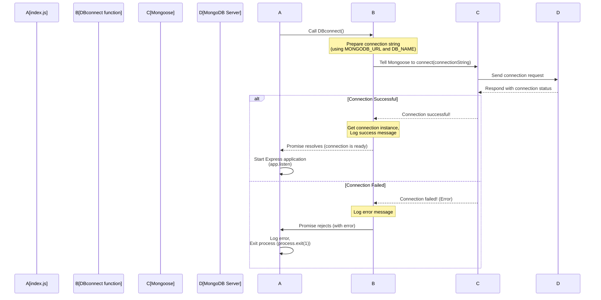

# Chapter 2: Database Connection (DBconnect)

Welcome back! In [Chapter 1: Mongoose Models](01_mongoose_models_.md), we learned how to define the structure and behavior of the data we want to store in our database using Mongoose Schemas and Models. We created blueprints for things like users and comments.

Now, defining the blueprints is great, but our application currently has no way to actually *use* those blueprints to save or fetch data. Why? Because it's not yet connected to the place where the data lives – the database!

Think of it like having detailed plans for building a house (your Mongoose Models). Those plans are useless unless you have a construction site (your database) and a way to get your builders and materials *to* that site.

This is where **Database Connection** comes in. It's the crucial step of opening a communication channel between our Node.js application and our MongoDB database.

## Why Connect to the Database?

Our backend application's main job is often to handle requests related to data:
*   A user signs up? Save their information.
*   Someone creates a new post? Store the post content and who wrote it.
*   Another user wants to see posts? Retrieve them from the database.

All these actions require the application to *talk* to the database. Without a connection, it's like a chef trying to cook a meal without being able to open the pantry or the fridge. The ingredients (data) are locked away.

We need a reliable way to establish this connection right when our application starts, and keep it open so that any part of our code that needs to interact with the database can do so seamlessly.

In our project, this task is handled by a specific function, often named `DBconnect` (short for Database Connect). Its purpose is simple but vital: make sure we are successfully linked to the database *before* our server is ready to handle incoming requests.

## How We Connect: The `DBconnect` Function

Let's look at the `index.js` file, which is the main starting point of our application. You'll see that one of the very first things it does after loading configuration is call a function named `DBconnect`.

Here's a simplified look at that part of `index.js`:

```javascript
import dotenv from "dotenv";
import DBconnect from "./src/db/db.js"; // Import our connection function
import app from "./src/App.js"; // We'll learn about 'app' later

dotenv.config({
  path: '.env', // Load environment variables (like DB URL)
});

// Call the DBconnect function and wait for it to finish
DBconnect()
  .then(() => {
    // ONLY if database connection is successful:
    app.listen( process.env.PORT || 8000, () => {
      console.log(`Server is running on port ${ process.env.PORT}`);
    });
  })
  .catch((error) => {
    // If database connection FAILS:
    console.log(`Error connecting to the database in index.js: ${error}`);
    process.exit(1); // Stop the application
  });
```

This snippet shows the core idea:
1.  We load necessary configuration (`dotenv.config`). This is important because our database connection details (like the database address) are sensitive and stored in environment variables (usually in a `.env` file), not directly in the code.
2.  We import the `DBconnect` function from `./src/db/db.js`.
3.  We call `DBconnect()`.
4.  Since connecting to a database takes time (it's an asynchronous operation), we use `.then()` and `.catch()`.
    *   The code inside `.then()` will *only* run if `DBconnect()` successfully connects to the database. This is where we start our web server (`app.listen`). It makes sense – why start the server if you can't even access your data?
    *   The code inside `.catch()` runs if `DBconnect()` fails for any reason (wrong password, database server offline, etc.). We log the error and then use `process.exit(1)` to shut down the application gracefully (or rather, ungracefully but indicating an error).

This structure ensures that our backend application will only start listening for web requests *after* a successful database connection has been established.

## Inside the `DBconnect` Function (`src/db/db.js`)

Now, let's peek inside the `DBconnect` function itself to see how it actually performs the connection using Mongoose.

This function is located in `src/db/db.js`:

```javascript
import mongoose from "mongoose";
import { DB_NAME } from "../constants.js"; // Import the database name

const DBconnect = async () => { // It's an async function because connecting takes time
  try {
    // Use mongoose.connect to connect to the database
    const connectionInstance = await mongoose.connect(
      `${process.env.MONGODB_URL}/${DB_NAME}`
    );

    // If successful, log a confirmation message
    console.log(
      `Database is conneted successfully : ${connectionInstance.connection.host}`
    );

  } catch (error) {
    // If connection fails, log an error message
    console.log(`The database connection is failed : ${error}`);
    // Exit the process with an error code (1)
    process.exit(1);
  }
};

export default DBconnect; // Make the function available to other files (like index.js)
```

Let's break this down:
1.  We import `mongoose` (the tool we use to interact with MongoDB) and `DB_NAME` (the specific name of our database, defined in `./src/constants.js`).
2.  We define an `async` function called `DBconnect`. `async` is used because the connection process involves waiting for an external resource (the database server).
3.  Inside the `try` block, we attempt the connection:
    *   `mongoose.connect(...)` is the key Mongoose function for establishing the connection.
    *   `${process.env.MONGODB_URL}/${DB_NAME}` is the connection string.
        *   `process.env.MONGODB_URL` comes from our environment variables and contains the address of our MongoDB server (e.g., `mongodb://localhost:27017` or a cloud URL).
        *   `/${DB_NAME}` specifies the particular database within that MongoDB server that we want to connect to.
    *   `await` tells JavaScript to pause here and wait until `mongoose.connect` finishes before moving on.
    *   If the connection is successful, `mongoose.connect` returns a `connectionInstance` object, which holds information about the connection.
4.  If the code inside `try` runs without errors, we print a success message, including the database host we connected to.
5.  If any error occurs during the `mongoose.connect` call, the code inside the `catch(error)` block is executed.
6.  In the `catch` block, we print an error message and then call `process.exit(1)`. `process.exit()` stops the Node.js process. Passing `1` indicates that the process exited due to an error. This is important behavior – if we can't connect to the database, the application cannot function correctly, so it's better to stop immediately and signal the failure.
7.  `export default DBconnect;` makes this function available to be imported in other files, like `index.js`.

## How it Works (Step-by-Step)

Here's a simple flow diagram illustrating the connection process when you run `index.js`:



This diagram shows the sequence: `index.js` initiates the process by calling `DBconnect`. `DBconnect` uses Mongoose, which communicates with the MongoDB server. Based on the server's response, the process either succeeds (allowing `index.js` to start the server) or fails (causing the application to exit).

## Analogy Revisited

Connecting to the database is like the moment the construction manager (our application) arrives at the site (MongoDB server) with the building plans ([Mongoose Models](01_mongoose_models_.md)) and sets up the temporary office and communication lines. They *must* confirm they can access the site and communicate properly before any actual building (saving/fetching data) can begin. The `DBconnect` function is that crucial setup step.

## Summary

In this chapter, we learned about the critical step of connecting our application to the MongoDB database.

*   We saw **why** database connection is necessary: to allow our application to read and write the data structured by our [Mongoose Models](01_mongoose_models_.md).
*   We identified the `DBconnect` function as the component responsible for this task.
*   We examined how `index.js` calls `DBconnect` and uses `.then()` and `.catch()` to ensure the server only starts after a successful connection.
*   We looked inside the `DBconnect` function to see how it uses `mongoose.connect`, constructs the connection string using environment variables and the database name, and handles success or failure.
*   We understood that connection failure leads to the application shutting down, as it cannot function without database access.

With our application now capable of connecting to the database, the next step is to prepare it to listen for and respond to web requests from users.

[Next Chapter: Express Application Instance (app)](03_express_application_instance__app__.md)

---

<sub><sup>Generated by [AI Codebase Knowledge Builder](https://github.com/The-Pocket/Tutorial-Codebase-Knowledge).</sup></sub> <sub><sup>**References**: [[1]](https://github.com/Aneeshraikwar/Backend/blob/4f07123346aeaca8aa0307e1463451754d8bb29d/index.js), [[2]](https://github.com/Aneeshraikwar/Backend/blob/4f07123346aeaca8aa0307e1463451754d8bb29d/src/constants.js), [[3]](https://github.com/Aneeshraikwar/Backend/blob/4f07123346aeaca8aa0307e1463451754d8bb29d/src/db/db.js)</sup></sub>