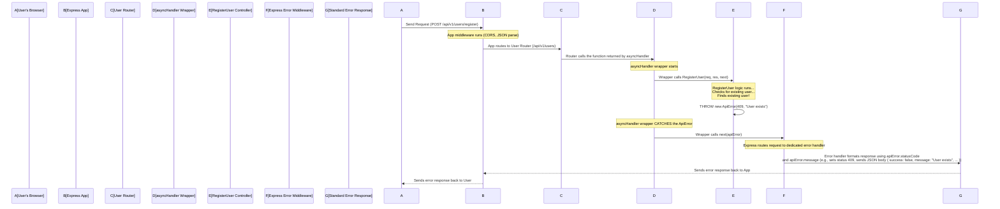

# Chapter 5: API Response and Error Handling

Welcome back! In [Chapter 1: Mongoose Models](01_mongoose_models_.md), we structured our data. In [Chapter 2: Database Connection (DBconnect)](02_database_connection__dbconnect__.md), we learned to connect to our database. [Chapter 3: Express Application Instance (app)](03_express_application_instance__app__.md) showed us how our application receives requests, and [Chapter 4: Routes](04_routes_.md) explained how incoming requests are directed to the right handler functions (controllers).

Now, what happens *inside* those handler functions (controllers)? They perform actions, often involving the database (saving data, fetching data). After performing the action, the controller needs to send a **response** back to the user who made the request. This response could indicate success (e.g., "User registered successfully!") or failure (e.g., "Username already exists").

Just sending back raw data or a simple error message isn't ideal for building a robust API. We need **standardized ways** to:

1.  Communicate success and include the relevant data consistently.
2.  Communicate errors clearly, providing status codes and helpful messages.
3.  Handle unexpected problems (like database errors) gracefully without crashing the server.

This is where `ApiResponse`, `ApiError`, and `asyncHandler` come in. They provide the tools to ensure our API communicates consistently and reliably, whether things go smoothly or run into trouble.

## Standardizing Success Responses with `ApiResponse`

When a user makes a request that succeeds (like logging in, updating their profile, or fetching their channel details), our backend needs to send back a positive confirmation, perhaps along with the data the user requested.

To keep things predictable for the frontend (or any other client consuming our API), we want the structure of a successful response to be the same every time. Instead of just sending back `{ user: { ... } }` for a login and `{ video: { ... } }` for fetching a video, a standard structure helps the client know what to expect.

The `ApiResponse` class in our project is designed precisely for this. It's a simple blueprint for creating a standard success response object.

Let's look at the definition of `ApiResponse` in `src/utils/ApiResponse.js`:

```javascript
// src/utils/ApiResponse.js
class ApiResponse {
  constructor(statusCode, data, message = "success") {
    this.statusCode = statusCode;
    this.data = data;
    this.message=message;
    // A success response always has success: true,
    // provided the status code is less than 400
    this.success=statusCode<400
  }
}

export {ApiResponse}
```

This class is quite simple:

*   It has a `constructor` that takes a `statusCode` (like 200 for OK, 201 for Created), the actual `data` to send back (e.g., the user object, a list of videos), and an optional `message` (defaults to "success").
*   It sets these values as properties (`this.statusCode`, `this.data`, `this.message`).
*   It also sets a `success` flag. Conventionally, HTTP status codes below 400 indicate success or redirection, so `this.success` is set to `true` if `statusCode` is less than 400.

Now, let's see how we use it in a controller function. Look at the `LoginUser` function in `src/controllers/User.js`:

```javascript
// src/controllers/User.js (simplified)
const LoginUser = asyncHandler(async (req, res) => {
  // ... (logic to find user and validate password) ...

  // If login is successful:
  // ... generate tokens ...
  // ... get user details without password/refreshToken ...

  const logedInUser = await User.findById(user._id).select(
    "-password -refreshToken"
  );

  // Define options for cookies (httpOnly, secure are important for security)
  const options = {
    httpOnly: true,
    secure: true, // Only send cookie over HTTPS
  };

  // Send the success response using ApiResponse
  return res
    .status(200) // Set HTTP status code to 200 (OK)
    .cookie("accessToken", AccessToken, options) // Set cookies
    .cookie("refreshToken", RefreshToken, options) // Set cookies
    .json(
      new ApiResponse(
        200, // Use ApiResponse constructor
        {
          user: logedInUser,
          AccessToken, // Include data needed by the client
          RefreshToken, // Include data needed by the client
        },
        "User LogedIn Successfully" // Add a custom message
      )
    );
});
```

In this example:

1.  The controller performs its logic.
2.  If everything is successful, it prepares the data it wants to send back (`logedInUser`, `AccessToken`, `RefreshToken`).
3.  It calls `res.status(200)` to set the HTTP status code of the response to 200.
4.  It uses `res.cookie()` to set authentication tokens in cookies (a common practice, covered more in [Chapter 6: Authentication Middleware (varifyJWT)](06_authentication_middleware__varifyjwt__.md)).
5.  Crucially, it calls `res.json()` to send a JSON response body. The content of the JSON body is created by instantiating `ApiResponse`: `new ApiResponse(200, { user: logedInUser, AccessToken, RefreshToken }, "User LogedIn Successfully")`.
6.  The frontend receives a JSON object that looks something like this:

    ```json
    {
      "statusCode": 200,
      "data": {
        "user": {
          "_id": "...",
          "username": "testuser",
          "email": "test@example.com",
          "Avatar": "...",
          "CoverImg": "..."
          // ... other user fields EXCEPT password and refreshToken
        },
        "AccessToken": "...",
        "RefreshToken": "..."
      },
      "message": "User LogedIn Successfully",
      "success": true
    }
    ```

Using `ApiResponse` ensures that *all* successful responses from our API will have this consistent `{ statusCode, data, message, success }` structure, making it much easier for the client application to handle responses uniformly.

## Standardizing Error Responses with `ApiError`

What happens when something goes wrong? A user tries to register with an email that's already taken, or provides an incorrect password during login, or requests a video that doesn't exist. These are **expected errors** that our application needs to handle gracefully.

Just like with success responses, we want error responses to have a consistent structure so the client can easily understand what went wrong. We also need to send appropriate HTTP status codes (like 400 for Bad Request, 401 for Unauthorized, 404 for Not Found, 409 for Conflict, 500 for Internal Server Error) to properly indicate the nature of the error.

The `ApiError` class is designed for creating these standardized error objects. It's a custom error class that extends Node.js's built-in `Error` class, adding specific properties relevant to API errors.

Let's look at the definition of `ApiError` in `src/utils/apiError.js`:

```javascript
// src/utils/apiError.js
class ApiError extends Error {
  constructor(
    statusCode,
    message = "something went wrong",
    errors = [],
    stack = ""
  ) {
    // Call the parent Error constructor with the message
    super(message);

    this.statusCode = statusCode;
    this.data = null; // Error responses typically don't have data
    this.message = message;
    this.success = false; // Indicates an error
    this.errors = errors; // Array for specific validation errors etc.

    // Capture the stack trace for debugging, unless a custom stack is provided
    if (stack) {
      this.stack = stack;
    } else {
      Error.captureStackTrace(this, this.constructor);
    }
  }
}

export { ApiError };
```

Key features of `ApiError`:

*   It `extends Error`, meaning it's a real JavaScript error object and can be `throw`n.
*   Its `constructor` takes `statusCode`, `message`, an optional `errors` array (useful for validation errors), and an optional `stack` trace.
*   It sets properties like `statusCode`, `message`, and `errors`.
*   Crucially, it sets `this.success = false;` to explicitly indicate that this response signifies a failure.
*   It handles capturing the error `stack` trace, which is helpful for debugging on the server side.

Now, how do we use `ApiError` in our controllers? We **throw** it!

Let's look at the `RegisterUser` controller function in `src/controllers/User.js`:

```javascript
// src/controllers/User.js (simplified)
const RegisterUser = asyncHandler(async (req, res) => {
  const { username, email, password } = req.body;

  // Example 1: Basic validation
  if ([username, email, password].some((field) => field?.trim() === "")) {
    // If any required field is empty, THROW an ApiError
    throw new ApiError(400, "All fields are required"); // 400 Bad Request
  }

  // Example 2: Check for existing user
  const existingUser = await User.findOne({
    $or: [{ username }, { email }],
  });
  if (existingUser) {
    // If user/email exists, THROW an ApiError
    throw new ApiError(
      409, // 409 Conflict
      "Error in existing User or username or email is exist" // Specific message
    );
  }

  // ... (logic to handle file uploads, create user, etc.) ...

  // If successful (code execution reaches here without throwing):
  // ... Send success response using ApiResponse ...
});
```

Notice how the controller uses `throw new ApiError(...)` whenever it encounters an expected error condition (missing fields, existing user). It doesn't explicitly *send* the error response itself (`res.status(...).json(...)`). It just throws the `ApiError` object.

But who catches these thrown errors and sends the actual response back to the user? This is where `asyncHandler` and Express's error handling mechanism come into play.

## Handling Asynchronous Errors Gracefully with `asyncHandler`

Backend development in Node.js is full of **asynchronous** operations: talking to the database, making API calls to other services, reading files, etc. These operations don't finish immediately; they return Promises or use callbacks, allowing your server to handle other requests while waiting.

Our controller functions are `async` because they often interact with the database (e.g., `await User.findOne(...)`, `await User.create(...)`). If an error occurs during an `await` operation (like a database connection issue) or if we `throw new ApiError(...)` inside an `async` function, that error needs to be caught and handled properly.

If an error is thrown inside an `async` Express route handler and isn't caught, it can lead to the entire Node.js process crashing, taking your server offline!

The `asyncHandler` utility function is designed to wrap our asynchronous controller functions to automatically catch any errors (thrown errors, rejected Promises) and pass them to Express's built-in error handling middleware. This prevents crashes and allows a central error handler to format and send the error response.

Let's see the definition of `asyncHandler` in `src/utils/asyncHandler.js`:

```javascript
// src/utils/asyncHandler.js
const asyncHandler = (requestHandler) => {
  // This function takes an async function (requestHandler)
  return (req, res, next) => {
    // It returns a new function that Express will actually call
    // This new function executes the original async function (requestHandler)
    // It wraps the execution in Promise.resolve() to handle both async/await
    // and standard Promises, and catches any rejection (error)
    Promise.resolve(requestHandler(req, res, next)).catch((err) => next(err));
    // If there's an error, it calls next(err), passing the error
    // to the next error-handling middleware in the Express chain.
  };
};

export { asyncHandler };
```

In essence, `asyncHandler` is a higher-order function (a function that returns a function). It takes your `async` controller function (`requestHandler`) and gives you back a slightly different function. This new function does the following when Express executes it:

1.  It runs your original `requestHandler` function.
2.  It waits for your `requestHandler` to finish (using `Promise.resolve()`).
3.  If your `requestHandler` finishes successfully (the Promise resolves), nothing happens, and the request continues.
4.  If your `requestHandler` throws an error or returns a rejected Promise, the `.catch((err) => next(err))` part catches it.
5.  It then calls `next(err)`. In Express, calling `next()` with an argument signals that an error occurred and skips all regular middleware/route handlers, jumping directly to the error-handling middleware.

Now let's look again at how our controller functions are *exported* in `src/controllers/User.js`:

```javascript
// src/controllers/User.js (exporting controllers)
export {
  RegisterUser, // This is the function returned by asyncHandler(async (req, res) => { ... })
  LoginUser, // This is the function returned by asyncHandler(async (req, res) => { ... })
  logOut, // This is the function returned by asyncHandler(async (req, res) => { ... })
  // ... etc ...
};
```

When we import these in our router (`src/routes/router.js`) and use them like `router.route("/register").post(..., RegisterUser);`, we are using the *wrapped* function returned by `asyncHandler`.

## How it Works Together: Request -> asyncHandler -> ApiError -> Response

Let's trace the path of a request that results in an expected error (like registering with an existing email) and see how `asyncHandler` and `ApiError` work with Express:



1.  The request comes in and goes through the Express app and relevant middleware ([Chapter 3](03_express_application_instance__app__.md)).
2.  The router ([Chapter 4](04_routes_.md)) matches the path/method and calls the function provided (which is the wrapped function from `asyncHandler`).
3.  The `asyncHandler` wrapper starts and calls our actual `RegisterUser` controller function.
4.  Inside `RegisterUser`, the code checks if the user already exists.
5.  Since the user exists, `RegisterUser` creates an `ApiError` instance (`new ApiError(409, "...")`) and **throws** it.
6.  The `asyncHandler` wrapper's `.catch()` block immediately catches this thrown `ApiError`.
7.  The `asyncHandler` calls `next(apiError)`, passing the caught error object to Express's next error-handling middleware.
8.  Express's default (or a custom configured) error handling middleware receives the `apiError` object. It sees it's an error object.
9.  This error handler uses the properties from our `apiError` object (specifically `statusCode` and `message`) to construct and send a standard JSON error response back to the client.

This is powerful because:
*   Our controllers stay clean; they just focus on logic and throwing errors when something is wrong.
*   We avoid crashing the server due to uncaught exceptions.
*   All errors, whether expected (`ApiError`) or unexpected (e.g., a coding mistake, a real database connection error), are caught by `asyncHandler` and routed to Express's error handler.
*   A central error handler (not shown in code snippets here, but typically configured in `App.js` or `index.js` using `app.use((err, req, res, next) => { ... })`) can then use the information in the error object (especially if it's an `ApiError`) to send a consistent error response format back to the client. If it's not an `ApiError` (an unexpected server error), the handler can send a generic 500 error and log the details on the server.

## Summary

In this chapter, we learned how our backend communicates outcomes back to the client in a structured way:

*   **`ApiResponse`**: A class used to create standard success response objects, ensuring consistency in the data and metadata (status code, message, success flag) sent back when an operation succeeds.
*   **`ApiError`**: A custom error class used to create standard error objects, including status codes, specific messages, and an explicit failure flag (`success: false`). Controllers `throw` these errors when expected problems occur.
*   **`asyncHandler`**: A utility function that wraps asynchronous controller functions. It automatically catches any errors (thrown `ApiError`s, rejected Promises) that occur during execution and passes them to Express's error-handling middleware using `next(err)`.

Together, these three utilities provide a robust pattern for handling both successful API responses and anticipated errors gracefully, preventing server crashes and ensuring clients receive consistent feedback.

Now that we understand how to structure data, connect to the DB, receive requests, route them, and send back standardized responses (or errors), the next crucial piece for many backend applications is security: ensuring only authenticated users can access certain features.

[Next Chapter: Authentication Middleware (varifyJWT)](06_authentication_middleware__varifyjwt__.md)

---

<sub><sup>Generated by [AI Codebase Knowledge Builder](https://github.com/The-Pocket/Tutorial-Codebase-Knowledge).</sup></sub> <sub><sup>**References**: [[1]](https://github.com/Aneeshraikwar/Backend/blob/4f07123346aeaca8aa0307e1463451754d8bb29d/src/controllers/User.js), [[2]](https://github.com/Aneeshraikwar/Backend/blob/4f07123346aeaca8aa0307e1463451754d8bb29d/src/utils/ApiResponse.js), [[3]](https://github.com/Aneeshraikwar/Backend/blob/4f07123346aeaca8aa0307e1463451754d8bb29d/src/utils/apiError.js), [[4]](https://github.com/Aneeshraikwar/Backend/blob/4f07123346aeaca8aa0307e1463451754d8bb29d/src/utils/asyncHandler.js)</sup></sub>