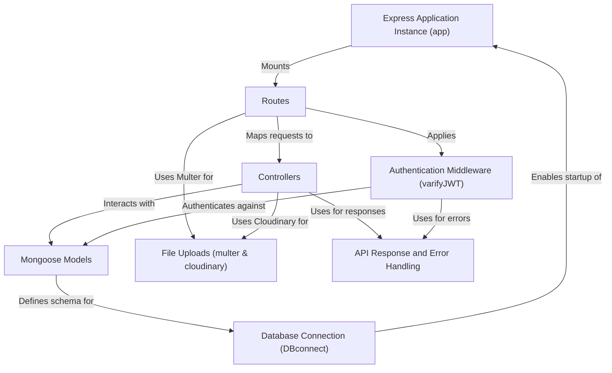
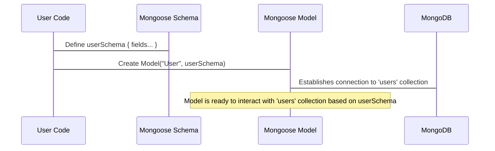

# Tutorial: Backend

This backend project provides the server-side logic for a web application, likely
a video sharing or social platform. It manages **user accounts**
(registration, login, profile updates), handles **secure authentication** using
tokens, allows **file uploads** for things like profile pictures, and
interacts with a **database** to store all the information. It's built
using the *Express* framework for handling requests and *Mongoose* for database
interactions.


## Visual Overview



## Chapters

1. [Mongoose Models
](01_mongoose_models_.md)
2. [Database Connection (DBconnect)
](02_database_connection__dbconnect__.md)
3. [Express Application Instance (app)
](03_express_application_instance__app__.md)
4. [Routes
](04_routes_.md)
5. [API Response and Error Handling
](05_api_response_and_error_handling_.md)
6. [Authentication Middleware (varifyJWT)
](06_authentication_middleware__varifyjwt__.md)
7. [File Uploads (multer & cloudinary)
](07_file_uploads__multer___cloudinary__.md)
8. [Controllers
](08_controllers_.md)

---

<sub><sup>Generated by [AI Codebase Knowledge Builder](https://github.com/The-Pocket/Tutorial-Codebase-Knowledge).</sup></sub>

# Chapter 1: Mongoose Models

Welcome to the `Backend` project tutorial! We're starting our journey by exploring how we structure the data we want to save in our database. If you've never built a backend before, don't worry – we'll take it step by step.

Imagine you're building a social media platform. You'll have users, posts, comments, likes, and so on. How do you make sure that when you save a user's information, it always includes their username, email, and password? And how do you ensure that the password is saved securely? This is where **Mongoose Models** come in!

Think of a Mongoose Model as a **blueprint** or a **template** for your data. It defines the structure (what fields exist, like username or email) and sometimes the behavior (like how to check a password) for documents in your MongoDB database. Mongoose is a tool that helps your Node.js application talk to a MongoDB database more easily and in a structured way.

## What are Schemas and Models?

Mongoose works with two main concepts that are important to understand right away:

1.  **Schema:** This is the actual blueprint. It describes the shape of your data. For example, a `User` schema would say: "A user has a `username` which must be text, a `password` which must also be text, an `email` which is text and unique, etc." It defines the fields and their data types (like text, numbers, dates, or even references to other blueprints).

2.  **Model:** Once you have a schema (the blueprint), you use it to create a **Model**. The Model is like a constructor or a factory that gives you tools to interact with the data in your database that follows this blueprint. You'll use the Model to create new pieces of data (called **documents** in MongoDB), find existing documents, update them, or delete them.

So, you define the blueprint (Schema) and then create a tool (Model) based on that blueprint to work with your data in the database.

## Defining a Blueprint (Schema)

Let's look at how we define one of these blueprints using Mongoose, specifically for our `User` data. This code comes from the `src/models/user.js` file in our project.

```javascript
import mongoose, { Schema } from "mongoose";

// Define the blueprint (Schema) for a User
const userSchema = new Schema(
  {
    username: {
      type: String, // Data type is text
      required: true, // This field MUST be present
      unique: true, // Each username must be different
      lowercase: true, // Store usernames in lowercase
      index: true, // Make finding users by username faster
    },
    email: {
      type: String,
      required: true,
      unique: true,
      lowercase: true,
      trim: true, // Remove leading/trailing spaces
    },
    password: {
      type: String,
      required: [true, "password is required"], // Password is required
    },
    Avatar: {
      type: String, // This will likely be a URL to an image
      required: true,
    },
    // ... other fields like fullName, watchHistory, refreshToken, CoverImg
  },
  { timestamps: true } // Mongoose adds 'createdAt' and 'updatedAt' fields automatically
);
```

In this snippet:
*   We import `mongoose` and `Schema`. `Schema` is what we use to define our blueprint.
*   We create a new `Schema` object, saving it in the `userSchema` variable.
*   Inside the `Schema` constructor, the first argument is an object where we list all the fields our `User` data should have (`username`, `email`, `password`, `Avatar`, etc.).
*   For each field, we specify its `type` (like `String` for text, `Number` for numbers, `Boolean` for true/false, `Schema.Types.ObjectId` for references to other documents).
*   We can add options like `required: true` to make a field mandatory, `unique: true` to ensure no two users have the same value for this field (like email or username), `lowercase: true` to automatically convert text to lowercase before saving, etc.
*   The second argument `{ timestamps: true }` is a helpful option provided by Mongoose. When you enable this, Mongoose automatically adds two fields to your blueprint and updates them: `createdAt` (when the data was first created) and `updatedAt` (when the data was last modified).

Let's look at another simple example, the `Comment` blueprint from `src/models/comments.js`:

```javascript
import mongoose, { Schema } from "mongoose";

const commentSchema = new Schema(
  {
    content: {
      type: String,
      required: true,
    },
    vidio: { // Note: This seems like a typo in the original code, should likely be 'video'
      type: Schema.Types.ObjectId, // This field will store the ID of a Video document
      ref: "vidio", // Tells Mongoose this ID refers to a document in the 'vidios' collection (based on the 'Vidio' model name)
    },
    owner: {
      type: Schema.Types.ObjectId, // This field will store the ID of a User document
      ref: "User", // Tells Mongoose this ID refers to a document in the 'users' collection (based on the 'User' model name)
    },
  },
  { timestamps: true }
);
// ... plugin and model definition later
```

Here, we see `Schema.Types.ObjectId` and `ref: "..."`. This is how we link one blueprint to another. A `comment` blueprint needs to know which `vidio` it belongs to and which `User` wrote it. `Schema.Types.ObjectId` stores the unique ID of the linked document, and `ref` tells Mongoose which Model (and thus which collection in MongoDB) this ID refers to.

## Creating a Factory (Model)

Once we have our `userSchema` (the blueprint), we need to create the actual `User` Model (the factory) from it. This is done using `mongoose.model()`.

```javascript
import mongoose, { Schema } from "mongoose";
// ... schema definition ...

// Create the Model from the Schema
export const User = mongoose.model("User", userSchema);
```

*   `mongoose.model()` takes two main arguments:
    *   The **name** of the Model (e.g., `"User"`). Mongoose will automatically create a MongoDB collection with a pluralized, lowercase version of this name (e.g., `"users"`).
    *   The **Schema** you defined (e.g., `userSchema`).
*   The `export const User = ...` part makes this `User` Model available for use in other parts of your application (like when you want to create a new user or find an existing one).

Now, you have a `User` Model that knows the structure of user data and is ready to interact with the `users` collection in your MongoDB database.

## Adding Behavior to the Blueprint (Schema Methods)

Sometimes, you want your blueprint (Schema) to also define certain actions or behaviors related to the data. For instance, how should a user object check if a provided password matches its stored, encrypted password? Mongoose Schemas allow you to add **methods** or **statics**.

Methods are functions that will be available on *individual documents* created from the model. Statics are functions available directly on the Model itself.

Look back at the `src/models/user.js` file. It adds a method:

```javascript
// ... schema definition ...

// Add a method to the userSchema
userSchema.methods.isPasswordCorrect = async function(password) {
  // 'this' refers to the specific user document
  return await bcrypt.compare(password, this.password);
};

// ... other methods like GenerateAcessToken, GenerateRefressToken ...

export const User = mongoose.model("User", userSchema);
```

Here:
*   We attach a function `isPasswordCorrect` to `userSchema.methods`.
*   Inside this function, `this` refers to the specific user document we are working with. So, `this.password` is the password stored for *that* user.
*   This method uses `bcrypt.compare` to safely compare the given `password` with the stored `this.password`.

This means that if you fetch a user document from the database using the `User` Model, that user document object will have an `isPasswordCorrect` function you can call! This is a neat way to keep data structure definition and related behaviors together.

## How Defining a Model Works (Under the Hood)

When you define a Schema and then create a Model from it using `mongoose.model()`, Mongoose does a few things:

1.  It reads your Schema definition, understanding the fields, their types, and options.
2.  It prepares internal structures that represent this data shape.
3.  When `mongoose.model()` is called, Mongoose associates the given name ("User") with your Schema (`userSchema`).
4.  It figures out which MongoDB collection this Model should interact with (usually by pluralizing and lowercasing the model name, so "User" maps to the "users" collection).
5.  It creates the Model object, which is like a special constructor with built-in functions (`find`, `create`, `findById`, etc.) that know how to perform database operations on the specified collection while respecting the structure defined in your Schema.

Here's a simplified look at the process:



This shows that your code defines the blueprint (Schema), then uses Mongoose to create the factory (Model). The Model is linked internally by Mongoose to the correct place in your MongoDB database (`users` collection), ready for action.

## Summary

In this chapter, we learned that:

*   Mongoose Models are essential for giving structure to our data in MongoDB.
*   A **Schema** is the blueprint, defining the fields and their types.
*   A **Model** is the factory created from a Schema, providing tools to interact with the database collection that holds data following that blueprint.
*   Schemas can also include behavior using methods or statics.
*   Mongoose connects a Model name to a specific collection in MongoDB.

Defining these models is the crucial first step in telling our application what kind of data it will be working with. But before we can actually use these models to save or retrieve data, our application needs to establish a connection to the MongoDB database itself.

In the next chapter, we'll dive into how we connect our application to the database using Mongoose.

[Next Chapter: Database Connection (DBconnect)](02_database_connection__dbconnect__.md)

---

<sub><sup>Generated by [AI Codebase Knowledge Builder](https://github.com/The-Pocket/Tutorial-Codebase-Knowledge).</sup></sub> <sub><sup>**References**: [[1]](https://github.com/Aneeshraikwar/Backend/blob/4f07123346aeaca8aa0307e1463451754d8bb29d/src/models/comments.js), [[2]](https://github.com/Aneeshraikwar/Backend/blob/4f07123346aeaca8aa0307e1463451754d8bb29d/src/models/likes.js), [[3]](https://github.com/Aneeshraikwar/Backend/blob/4f07123346aeaca8aa0307e1463451754d8bb29d/src/models/playlist.js), [[4]](https://github.com/Aneeshraikwar/Backend/blob/4f07123346aeaca8aa0307e1463451754d8bb29d/src/models/subscribtion.js), [[5]](https://github.com/Aneeshraikwar/Backend/blob/4f07123346aeaca8aa0307e1463451754d8bb29d/src/models/tweets.js), [[6]](https://github.com/Aneeshraikwar/Backend/blob/4f07123346aeaca8aa0307e1463451754d8bb29d/src/models/user.js), [[7]](https://github.com/Aneeshraikwar/Backend/blob/4f07123346aeaca8aa0307e1463451754d8bb29d/src/models/vidio.js)</sup></sub>